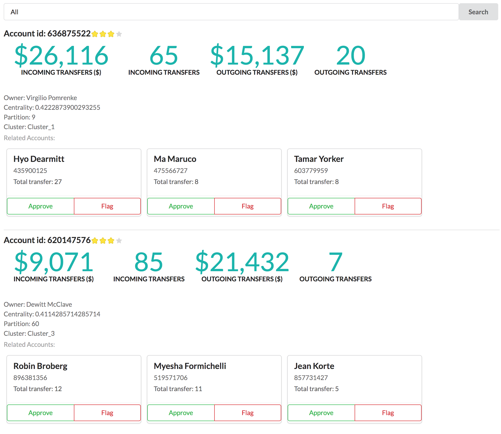

# payments-demo-graphql

Simple GRAND stack (GraphQL, React, Apollo, Neo4j Database) web app dashboard for use with payments dataset.



## Install

### Neo4j

You'll need a Neo4j instance with the payments dataset installed.

Install the [neo4j-graphql](https://github.com/neo4j-graphql/neo4j-graphql#building-manually) server extension for Neo4j.

Once Neo4j is running with the neo4j-graphql extension installed, POST the GraphQL schema to Neo4j:

```
curl --data "@graphql/schema.graphql" http://localhost:7474/graphql/idl/
```

### Webapp

Currently, the webapp assumes the GraphQL endpoint is available at `http://localhost:7474/graphql/`

```
npm install
npm start
```

